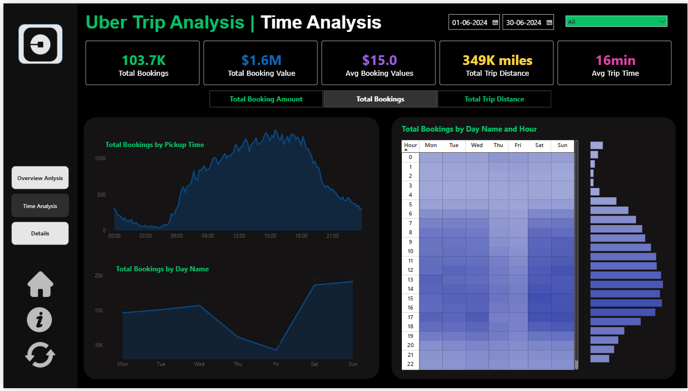
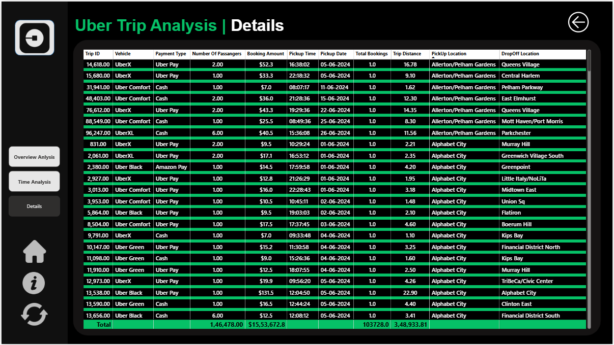

# 🚕 Uber Trip Analysis — Power BI Dashboard

<div align="center">


**An interactive Power BI dashboard analysing 103,728 Uber trips across New York City in June 2024 — covering bookings, revenue, trip patterns, location hotspots, and time-based analysis.**

</div>

---

## 📸 Dashboard Preview

### Overview Analysis
> KPI cards · Payment breakdown · Vehicle type analysis · Location heatmap


---

### Time Analysis
> Hourly trip trends · Day-of-week patterns · Day × Hour heatmap matrix



---

### Details
> Full trip-level table with filters by vehicle, payment type, and date range



---

## 📊 Key Metrics

| Metric | Value |
|---|---|
| 🚖 Total Bookings | **103,728** |
| 💰 Total Booking Value | **$1,553,673** |
| 💳 Avg Booking Amount | **$15.0** |
| 📍 Total Trip Distance | **349K miles** |
| 📏 Avg Trip Distance | **3 miles** |
| ⏱️ Avg Trip Time | **16 min** |
| 📅 Date Range | **Jun 01 – Jun 30, 2024** |

---

## 🗂️ Dataset Overview

| Property | Detail |
|---|---|
| **Source** | Uber NYC Trip Records |
| **Rows** | 103,728 trips |
| **Date Range** | June 2024 |
| **Vehicle Types** | UberX · Uber Black · Uber Comfort · Uber Green · UberXL |
| **Payment Types** | Uber Pay · Cash · Amazon Pay · Google Pay |
| **Location Data** | NYC pickup & drop-off zones (263 locations) |

---

## 🧠 Data Model

```
Uber Details (Fact)
    ├── Location Details       [PULocationID → LocationID] ✅ Active
    ├── Location Details       [DOLocationID → LocationID] ⚪ Inactive (USERELATIONSHIP)
    ├── Calender Table         [Pickup date → Date]
    ├── LocalDateTable         [Pickup Time → Date]
    └── LocalDateTable         [Drop Off Time → Date]

Dynamic Measure              — Field parameter for metric switching
Dynamic Measure 2            — Secondary field parameter
```

---

## 📐 DAX Measures

| Measure | Description |
|---|---|
| `Total Bookings` | `COUNT('Uber Details'[Trip ID])` |
| `Total Booking Amount` | `SUM(fare_amount) + SUM(Surge Fee)` |
| `Avg Booking Amount` | `DIVIDE([Total Booking Amount], [Total Bookings])` |
| `Total Trip Distance` | Formatted string — total miles in `K miles` |
| `Avg Trip Distance` | `ROUND(AVERAGE(trip_distance), 0)` in miles |
| `Avg Trip Time` | `AVERAGEX` with `DATEDIFF` in minutes |
| `Most Frequent Pickup Point` | `TOPN + SUMMARIZE` on LocationID |
| `Most Frequent Dropout` | `USERELATIONSHIP` on inactive DOLocationID |
| `Farthest Trip` | `MAX(trip_distance)` with pickup & dropoff lookup |
| `Title for by Pickup Time` | Dynamic title via `SELECTEDVALUE` |
| `Title for by Day Name` | Dynamic title via `SELECTEDVALUE` |
| `Title by Hour and Day` | Dynamic title via `SELECTEDVALUE` |

---

## 🎯 Dashboard Pages

### 1️⃣ Overview Analysis
- **KPI Row** — Total Bookings, Total Booking Value, Avg Booking Amount, Total Trip Distance, Avg Trip Distance, Avg Trip Time
- **Dynamic Tab Switcher** — Toggle between Total Booking Amount / Total Bookings / Total Trip Distance across all charts
- **Donut Charts** — Breakdown by Payment Type and Day/Night trips
- **Vehicle Type Table** — Bookings, revenue, and avg fare per vehicle
- **Location Cards** — Most frequent pickup & dropoff zones
- **Farthest Trip** — Pickup → dropoff route with distance
- **Bar Charts** — Total bookings by location & most preferred vehicle per location

### 2️⃣ Time Analysis
- **Area Chart** — Total bookings by pickup hour (00:00–23:00)
- **Line Chart** — Total bookings by day of week (Mon–Sun)
- **Heatmap Matrix** — Bookings by Hour × Day Name with colour intensity
- **Dynamic Titles** — All chart titles update based on selected metric

### 3️⃣ Details
- Full drill-through trip table with date range slicer and vehicle/payment filters

---

## ⚙️ Features & Techniques

- ✅ **Dynamic field parameters** — single slicer switches metric across all visuals
- ✅ **USERELATIONSHIP** — activates inactive dropoff location relationship in DAX
- ✅ **Day/Night segmentation** — calculated column classifying trips by pickup hour
- ✅ **Custom Calendar Table** — supports day name sorting and weekday analysis
- ✅ **Dynamic chart titles** — titles update automatically with selected metric
- ✅ **Custom dark theme** — Uber-branded Night Ride theme (JSON)
- ✅ **Cross-page KPI consistency** — same KPI cards across all dashboard pages

---

## 🚀 How to Run

1. Clone this repository
   ```bash
   git clone https://github.com/YOUR_USERNAME/uber-trip-analysis.git
   ```
2. Open `Uber Taxi Power BI Analysis.pbix` in **Power BI Desktop**
3. If prompted, refresh the data source connection
4. Explore the 3 dashboard pages using the left navigation panel

---

## 🛠️ Tools Used

| Tool | Purpose |
|---|---|
| Power BI Desktop | Dashboard development |
| DAX | Measures, calculated columns, dynamic titles |
| Power Query (M) | Data transformation & loading |
| JSON Theme File | Custom Uber Night Ride dark theme |

---

## 📁 Repository Structure

```
uber-trip-analysis/
│
├── 📊 Uber Taxi Power BI Analysis.pbix   ← Main Power BI file
├── 📄 README.md                           ← This file
├── 🎨 UberNightRide_Theme.json            ← Custom dark theme
│
└── 📸 screenshots/
    ├── overview.png                       ← Overview page screenshot
    ├── time_analysis.png                  ← Time analysis page screenshot
    └── details.png                        ← Details page screenshot
```

---

## 👤 Author

**Your Name**
- GitHub: [@KunalKushwaha](https://github.com/kunalkushwaha09)
- LinkedIn: [linkedin.com/in/Kunal Kushwaha]([https://linkedin.com/in/your_profile](https://www.linkedin.com/in/kunal-kushwaha-94434821a/))

---

<div align="center">

⭐ **If you found this project useful, please give it a star!** ⭐

</div>
